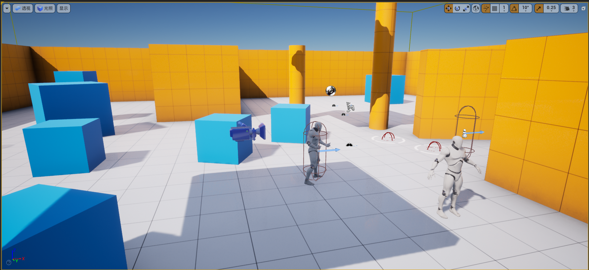

# Coop第一人称射击个人项目

- 环境配置
    - Visual Studio 2017
    - Unreal Engine4.27
    - Cpp+蓝图
- 功能实现
    - 触发器设置（蓝图发起）
        - 跳板
        - 游戏结束：条件检测，区域触发
        - 物体受击：碰撞检测，物体识别，初速度计算
    - 武器设置（cpp编写逻辑）
        - 种类
            - 步枪：射击子弹为匀速直线，射速快
            - 榴弹枪：射击子弹为抛物线，射速慢
        - 特效
            - 子弹命中后触发击中特效
            - 物体被击中后发生相应变化
    - 敌人AI（蓝图）
        - 自动巡逻：按给定点线路进行自动巡逻，会被子弹撞击物体的事件吸引目光
        - 遇敌机制：设定为目击到主角后游戏结束
    - 主角
        - 动作绑定，端枪、蹲下、跳跃、跑动等动作